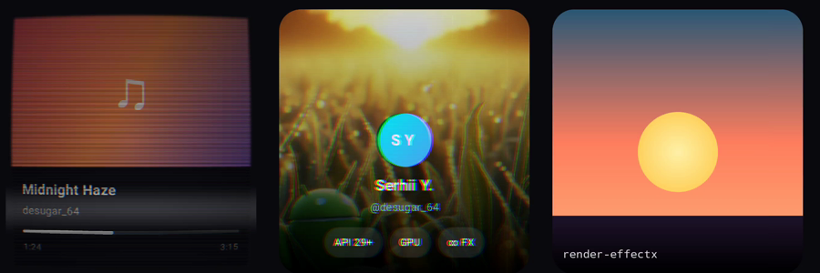
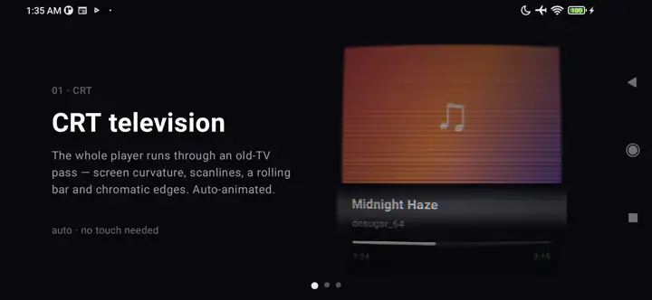

# RenderEffectX: experimental per-pixel GPU effects on Jetpack Compose content

> [!CAUTION]
> **Not a library, not production-ready. A for-fun experiment.** Expect rough edges, breaking
> changes and unhandled cases. Don't ship it.

<p align="center">
  
</p>

## What this is not

- **Not a backport or replica of `RenderEffect` / AGSL `RuntimeShader`.** It doesn't match their
  API, doesn't call `View.setRenderEffect`, doesn't hand off to the platform on API 31+.
- **A narrow subset.** One Modifier, one GL pass, GLSL ES shader strings. No effect graph, no
  chaining/blending, no built-in catalog, no Kotlin→GPU DSL, no AGSL.
- **Limited, throwaway-grade.** Minimal error handling, no resource-lifecycle polish.

It exists to prove one thing: how flexible the `HardwareBuffer` / `HardwareRenderer` / hardware
`Bitmap` path is: enough to run per-pixel shader effects on live Compose content, down to API 29,
where AGSL `RuntimeShader` doesn't exist yet (that's API 33+).

## What it is

One Modifier, `Modifier.runtimeEffect(effect)`, captures the composable's content into a
`HardwareBuffer` (no CPU readback), imports it zero-copy as an OpenGL ES texture, runs your GLSL ES
fragment shader over it, and draws the result back. The effect lands on the composable's **own
content**, not a `SurfaceView`, not the window background. Same *spirit* as
`RenderEffect.createRuntimeShaderEffect` ("write a per-pixel function, get the processed content
back"), its own small implementation.

## Demos

The sample app is a landscape pager of three mini-demos, each applying one **animatable** effect
straight to a Compose card (not a SurfaceView). Recorded scrolling through the pager on a device,
on a **release R8** build:

<p align="center">
  
</p>

- **CRT television.** Screen curvature, scanlines, chromatic edges, a rolling bar. `crtEffect(time)`
- **Glitch burst.** Channel split, block tearing, scanlines, dropout. `glitchEffect(time, intensity)`
- **Chromatic ripple.** An RGB shockwave radiating from your touch. `chromaticRippleEffect(...)`

All three are driven the same way: rebuild the effect each frame with new uniform values (animate
with any Compose animation API). The session caches the compiled program by shader source, so only
the uniforms change, which keeps animating cheap.

## Using it

A shader gets `sampler2D content` (the captured composable), `varying vec2 vTexCoord` (0..1,
Y-flip handled), `vec2 iResolution` (source px), plus any `float`/color uniforms you set. That's
the whole contract.

```kotlin
val invert = RuntimeEffect(
    """
    precision mediump float;
    uniform sampler2D content;
    varying vec2 vTexCoord;
    void main() {
        vec4 c = texture2D(content, vTexCoord);
        gl_FragColor = vec4(1.0 - c.rgb, c.a);   // invert, keep alpha
    }
    """.trimIndent()
)

Box(Modifier.runtimeEffect(invert)) {
    // ...any composable content; its pixels go through the shader
}
```

Public API:
[`Modifier.runtimeEffect()`](rendereffectx/src/main/java/dev/serhiiyaremych/rendereffectx/RuntimeEffectModifier.kt),
[`RuntimeEffect`](rendereffectx/src/main/java/dev/serhiiyaremych/rendereffectx/RuntimeEffect.kt)
(`setFloatUniform` / `setColorUniform`, plus `PASSTHROUGH` / `tint` / `blur` / `wave`).
The demo shaders live in the sample, not the library:
[`DemoEffects.kt`](app/src/main/java/dev/serhiiyaremych/rendereffectx/DemoEffects.kt).

## A full effect, end to end: chromatic ripple

The shader (GLSL ES 2.0):

```glsl
precision mediump float;
uniform sampler2D content;
uniform vec2  iResolution;
uniform vec2  center;     // tap point, 0..1
uniform float radius;     // current ring radius, expands outward
uniform float strength;   // 0..1, decays as the ring fades
varying vec2  vTexCoord;

void main() {
    vec2 uv  = vTexCoord;
    vec2 dir = uv - center;
    float aspect = iResolution.x / iResolution.y;
    float dist = length(vec2(dir.x * aspect, dir.y));   // aspect-correct → round ring

    float ring   = exp(-pow((dist - radius) * 7.0, 2.0));   // soft gaussian ring
    float amount = ring * strength;

    vec2 n  = normalize(dir + 1e-5);
    float off = amount * 0.075;
    vec3 col;
    col.r = texture2D(content, uv + n * off).r;          // split the channels along the ring
    col.g = texture2D(content, uv + n * off * 0.3).g;
    col.b = texture2D(content, uv - n * off).b;
    col += amount * 0.22;                                 // faint crest highlight

    gl_FragColor = vec4(col, texture2D(content, uv).a);
}
```

Built and animated from Compose (one `Animatable` per tap drives `radius` 0→1.4 while
`strength` decays 1→0):

```kotlin
fun chromaticRippleEffect(centerX: Float, centerY: Float, radius: Float, strength: Float) =
    RuntimeEffect(CHROMATIC_RIPPLE_SRC).apply {
        setFloatUniform("center", centerX, centerY)
        setFloatUniform("radius", radius)
        setFloatUniform("strength", strength)
    }
```

## How it works

`Modifier.runtimeEffect` is a thin binding; the real work lives in standalone engines:

- **`LayerBufferCapture`** records the content into a `GraphicsLayer` and turns it into a GPU
  `HardwareBuffer` with no CPU readback (`HardwareRenderer` → `ImageReader`,
  `ImageFormat.PRIVATE`, `USAGE_GPU_SAMPLED_IMAGE`).
- **`RuntimeEffectSession`** owns one long-lived GL thread (androidx `GLRenderer`), a program
  cache keyed by shader source, and a ping-pong output pool. It imports the buffer zero-copy
  (`eglCreateImageFromHardwareBuffer` + `glEGLImageTargetTexture2DOES`), runs the shader, and
  hands back the result as a hardware `Bitmap` (`Bitmap.wrapHardwareBuffer`, API 29+).

Pixels stay on the GPU end-to-end: capture → shader → draw, no `glReadPixels` round-trip. That
zero-copy `HardwareBuffer` path is the thing this experiment is really poking at.

## Credits

- The **CRT** scene is adapted from the Shadertoy shader *"CRT"*
  (https://www.shadertoy.com/view/tfdBzj), ported from its GLSL ES 3.0 (`mainImage` /
  `iChannel0` / `texture`) form to this project's GLSL ES 2.0 contract.
- The GPU capture approach and GL abstractions grew out of a sister experiment,
  [imla](https://github.com/desugar-64/imla).

## License

MIT. See [LICENSE](LICENSE).

## Status

A throwaway-grade experiment, kept around because the result was fun. It is not a product and
is not maintained as one.
